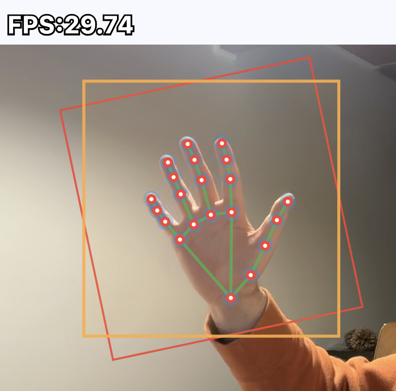
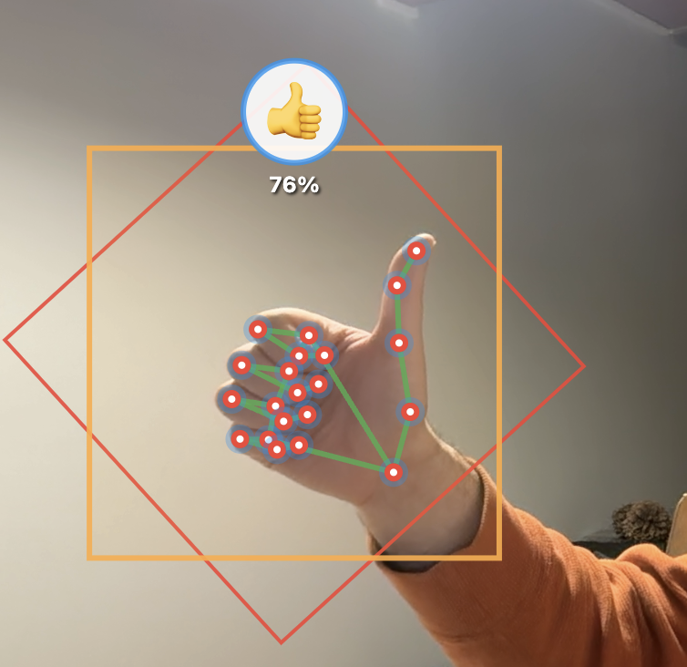

# hand_detection

[](https://pub.dev/packages/hand_detection/score)
[](https://pub.dev/packages/hand_detection)

Flutter implementation of Google's MediaPipe hand detection and landmark models using TensorFlow Lite.
Completely local: no remote API, just pure on-device, offline detection.

### Hand Detection with 21-Point Landmarks



## Features

- On-device hand detection, runs fully offline
- 21-point hand landmarks with **3D depth information** (x, y, z coordinates)
- Handedness detection (left/right hand)
- **Gesture recognition**: closed fist, open palm, pointing up, thumbs down, thumbs up, victory, I love you
- All coordinates are in absolute pixel coordinates
- Truly cross-platform: compatible with Android, iOS, macOS, Windows, and Linux
- Native OpenCV preprocessing (resize/letterbox/crops) for optimized throughput
- The [example](https://pub.dev/packages/hand_detection/example) app illustrates how to detect and render results on images

## Quick Start

```dart
import 'dart:io';
import 'package:hand_detection/hand_detection.dart';

Future main() async {
  HandDetector detector = HandDetector();
  await detector.initialize();

  final imageBytes = await File('path/to/image.jpg').readAsBytes();
  List<Hand> hands = await detector.detect(imageBytes);

  for (final hand in hands) {
    final boundingBox = hand.boundingBox;
    final handedness = hand.handedness;

    if (hand.hasLandmarks) {
      final wrist = hand.getLandmark(HandLandmarkType.wrist);
      final indexTip = hand.getLandmark(HandLandmarkType.indexFingerTip);
      print('Wrist: (${wrist?.x}, ${wrist?.y})');
    }
  }

  await detector.dispose();
}
```

## Performance

XNNPACK can be enabled for 2-5x CPU speedup via SIMD vectorization (NEON on ARM, AVX on x86):

```dart
final detector = HandDetector(
  performanceConfig: PerformanceConfig.xnnpack(),
);
await detector.initialize();
```

### Advanced: Direct Mat Input

For live camera streams, you can bypass image encoding/decoding entirely by using `detectOnMat()`:

```dart
import 'package:hand_detection/hand_detection.dart';

Future<void> processFrame(cv.Mat frame) async {
  final detector = HandDetector();
  await detector.initialize();

  // Direct Mat input - fastest for video streams
  final hands = await detector.detectOnMat(frame);

  frame.dispose(); // always dispose Mats after use
  await detector.dispose();
}
```

**When to use `detectOnMat()`:**
- Live camera streams where frames are already in memory
- When you need to preprocess images with OpenCV before detection
- Maximum throughput scenarios (avoids JPEG encode/decode overhead)

**For all other cases**, use the standard `detect()` method with image bytes.

## Bounding Boxes

The `boundingBox` property returns a `BoundingBox` object representing the hand bounding box in
absolute pixel coordinates.

### Accessing Bounding Box

```dart
final BoundingBox boundingBox = hand.boundingBox;

// Access edges
final double left = boundingBox.left;
final double top = boundingBox.top;
final double right = boundingBox.right;
final double bottom = boundingBox.bottom;

// Calculate dimensions
final double width = boundingBox.right - boundingBox.left;
final double height = boundingBox.bottom - boundingBox.top;

print('Box: ($left, $top) to ($right, $bottom)');
print('Size: $width x $height');
```

## Hand Landmarks (21-Point)

The `landmarks` property returns a list of 21 `HandLandmark` objects representing key points
on the detected hand. Each landmark has 3D coordinates (x, y, z) and a visibility score.

### 21 Hand Landmarks

| Index | Landmark | Description |
|-------|----------|-------------|
| 0 | wrist | Wrist |
| 1-4 | thumbCMC, thumbMCP, thumbIP, thumbTip | Thumb joints and tip |
| 5-8 | indexFingerMCP, indexFingerPIP, indexFingerDIP, indexFingerTip | Index finger |
| 9-12 | middleFingerMCP, middleFingerPIP, middleFingerDIP, middleFingerTip | Middle finger |
| 13-16 | ringFingerMCP, ringFingerPIP, ringFingerDIP, ringFingerTip | Ring finger |
| 17-20 | pinkyMCP, pinkyPIP, pinkyDIP, pinkyTip | Pinky finger |

### Accessing Landmarks

```dart
final Hand hand = hands.first;

// Access specific landmarks by type
final wrist = hand.getLandmark(HandLandmarkType.wrist);
final indexTip = hand.getLandmark(HandLandmarkType.indexFingerTip);
final thumbTip = hand.getLandmark(HandLandmarkType.thumbTip);

if (wrist != null) {
  print('Wrist: (${wrist.x}, ${wrist.y}, ${wrist.z})');
  print('Visibility: ${wrist.visibility}');
}

// Iterate through all landmarks
for (final landmark in hand.landmarks) {
  print('${landmark.type.name}: (${landmark.x}, ${landmark.y})');
}
```

### Drawing Hand Skeleton

Use the `handLandmarkConnections` constant to draw the hand skeleton:

```dart
import 'package:hand_detection/hand_detection.dart';

// Draw skeleton connections
for (final connection in handLandmarkConnections) {
  final start = hand.getLandmark(connection[0]);
  final end = hand.getLandmark(connection[1]);

  if (start != null && end != null) {
    canvas.drawLine(
      Offset(start.x, start.y),
      Offset(end.x, end.y),
      paint,
    );
  }
}
```

## Handedness

The `handedness` property indicates whether the detected hand is a left or right hand:

```dart
final Hand hand = hands.first;

if (hand.handedness == Handedness.left) {
  print('Left hand detected');
} else if (hand.handedness == Handedness.right) {
  print('Right hand detected');
}
```

## Gesture Recognition

Enable gesture recognition to classify hand poses into 7 gestures:



| Gesture | Description |
|---------|-------------|
| closedFist | Closed fist |
| openPalm | Open palm |
| pointingUp | Index finger pointing up |
| thumbDown | Thumbs down |
| thumbUp | Thumbs up |
| victory | Victory / peace sign |
| iLoveYou | "I love you" sign |

### Enabling Gestures

```dart
final detector = HandDetector(
  enableGestures: true,
  gestureMinConfidence: 0.5, // optional, default 0.5
);
await detector.initialize();

final hands = await detector.detect(imageBytes);
for (final hand in hands) {
  if (hand.hasGesture) {
    print('Gesture: ${hand.gesture!.type.name}');
    print('Confidence: ${hand.gesture!.confidence}');
  }
}
```

Gesture recognition uses a two-stage pipeline (gesture embedder + classifier) and requires `HandMode.boxesAndLandmarks` (the default mode).

## Detection Modes

This package supports two detection modes:

| Mode | Features | Speed |
|------|----------|-------|
| **boxesAndLandmarks** (default) | Bounding boxes + 21 landmarks + handedness | Standard |
| **boxes** | Bounding boxes only | Faster |

### Code Examples

```dart
// Full mode (default): bounding boxes + 21 landmarks + handedness
final detector = HandDetector(
  mode: HandMode.boxesAndLandmarks,
);

// Fast mode: bounding boxes only
final detector = HandDetector(
  mode: HandMode.boxes,
);
```

## Configuration Options

The `HandDetector` constructor accepts several configuration options:

```dart
final detector = HandDetector(
  mode: HandMode.boxesAndLandmarks,      // Detection mode
  landmarkModel: HandLandmarkModel.full, // Landmark model variant
  detectorConf: 0.6,                     // Palm detection confidence (0.0-1.0)
  maxDetections: 10,                     // Maximum hands to detect
  minLandmarkScore: 0.5,                 // Minimum landmark confidence (0.0-1.0)
  interpreterPoolSize: 1,                // TFLite interpreter pool size
  performanceConfig: PerformanceConfig.xnnpack(), // Performance optimization
  enableGestures: false,                 // Enable gesture recognition
  gestureMinConfidence: 0.5,             // Minimum gesture confidence (0.0-1.0)
);
```

## Live Camera Detection

For real-time hand detection with a camera feed, use `detectOnMat()` to avoid repeated JPEG encode/decode overhead:

```dart
import 'package:camera/camera.dart';
import 'package:hand_detection/hand_detection.dart';

HandDetector detector = HandDetector(
  performanceConfig: PerformanceConfig.xnnpack(),
);
await detector.initialize();

final cameras = await availableCameras();
CameraController camera = CameraController(cameras.first, ResolutionPreset.medium);
await camera.initialize();

camera.startImageStream((CameraImage image) async {
  // Convert CameraImage (YUV420) directly to cv.Mat (BGR)
  final cv.Mat mat = convertCameraImageToMat(image); // see example app

  // Detect hands using Mat for maximum performance
  List<Hand> hands = await detector.detectOnMat(mat);

  // Always dispose Mat after use
  mat.dispose();

  // Process hands...
});
```

**Key points:**
- Use `detectOnMat()` instead of `detect()` to bypass JPEG encoding/decoding
- Convert YUV420 camera frames directly to BGR Mat format
- Always call `mat.dispose()` after detection
- Use `HandMode.boxes` for fastest real-time performance

See the full [example app](https://pub.dev/packages/hand_detection/example) for complete implementation.

## Example

The [sample code](https://pub.dev/packages/hand_detection/example) from the pub.dev example tab includes a
Flutter app that paints detections onto an image: bounding boxes and 21-point hand landmarks with skeleton connections.
