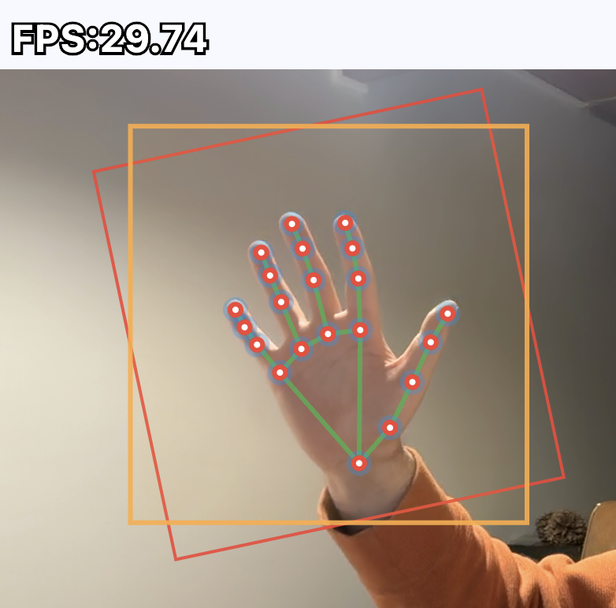
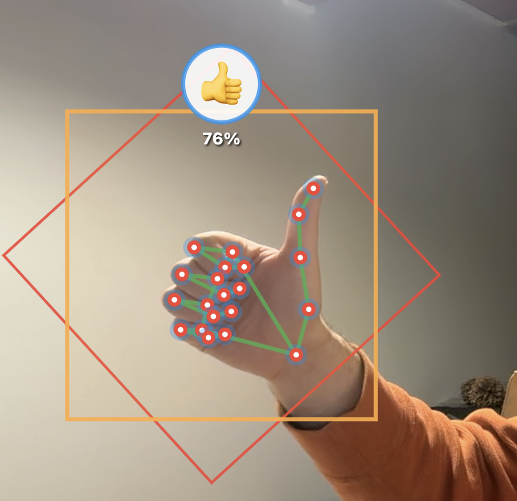

<h1 align="center">hand_detection</h1>

<p align="center">
<a href="https://flutter.dev"></a>
<a href="https://dart.dev"></a>
<br>
<a href="https://pub.dev/packages/hand_detection"></a>
<a href="https://pub.dev/packages/hand_detection/score"></a>
<a href="https://github.com/hugocornellier/hand_detection/actions/workflows/build.yml"></a>
<a href="https://github.com/hugocornellier/hand_detection/actions/workflows/integration.yml"></a>
<a href="https://github.com/hugocornellier/hand_detection/blob/main/LICENSE"></a>
</p>

Flutter implementation of Google's MediaPipe hand detection and landmark models using TensorFlow Lite.
Completely local: no remote API, just pure on-device, offline detection.

### Hand Detection with 21-Point Landmarks 
 


## Features

- On-device hand detection, runs fully offline
- 21-point hand landmarks with **3D depth information** (x, y, z coordinates)
- Handedness detection (left/right hand)
- **Gesture recognition**: closed fist, open palm, pointing up, thumbs down, thumbs up, victory, I love you
- Truly cross-platform: compatible with Android, iOS, macOS, Windows, and Linux
- The [example](https://pub.dev/packages/hand_detection/example) app illustrates how to detect and render results on images

## Quick Start

```dart
import 'dart:io';
import 'package:hand_detection/hand_detection.dart';

Future main() async {
  final detector = await HandDetector.create();

  final imageBytes = await File('path/to/image.jpg').readAsBytes();
  List<Hand> hands = await detector.detect(imageBytes);

  for (final hand in hands) {
    final boundingBox = hand.boundingBox;
    final handedness = hand.handedness;

    if (hand.hasLandmarks) {
      final wrist = hand.getLandmark(HandLandmarkType.wrist);
      final indexTip = hand.getLandmark(HandLandmarkType.indexFingerTip);
      print('Wrist: (${wrist?.x}, ${wrist?.y})');
    }
  }

  await detector.dispose();
}
```

## Performance

### Hardware Acceleration

The package automatically selects the best acceleration strategy for each platform:

| Platform | Default Delegate | Speedup | Notes |
|----------|-----------------|---------|-------|
| **macOS** | XNNPACK | 2-5x | SIMD vectorization (NEON on ARM, AVX on x86) |
| **Linux** | XNNPACK | 2-5x | SIMD vectorization |
| **iOS** | Metal GPU | 2-4x | Hardware GPU acceleration |
| **Android** | XNNPACK | 2-5x | ARM NEON SIMD acceleration |
| **Windows** | XNNPACK | 2-5x | SIMD vectorization (AVX on x86) |

No configuration needed, just call `initialize()` and you get the optimal performance for your platform.

### Advanced Performance Configuration

```dart
// Auto mode (default), optimal for each platform
final detector = await HandDetector.create();

// Force XNNPACK (all native platforms)
final detector = await HandDetector.create(
  performanceConfig: PerformanceConfig.xnnpack(numThreads: 4),
);

// Force GPU delegate (iOS recommended, Android experimental)
final detector = await HandDetector.create(
  performanceConfig: PerformanceConfig.gpu(),
);

// CPU-only (maximum compatibility)
final detector = await HandDetector.create(
  performanceConfig: PerformanceConfig.disabled,
);
```

### Advanced: Direct Mat Input

If you already have a decoded `cv.Mat` from another OpenCV pipeline, pass it directly:

```dart
import 'package:hand_detection/hand_detection.dart';

Future<void> processFrame(Mat frame) async {
  final detector = await HandDetector.create();

  final hands = await detector.detectFromMat(frame);

  frame.dispose(); // always dispose Mats after use
  await detector.dispose();
}
```

For live camera streams, prefer `prepareCameraFrame` + `detectFromCameraFrame` (see below): it keeps `cvtColor` / `rotate` / downscale off the UI thread.

## Bounding Boxes

The boundingBox property returns a BoundingBox object representing the hand bounding box in
absolute pixel coordinates. The BoundingBox provides convenient access to corner points,
dimensions (width and height), and the center point.

### Accessing Corners

```dart
final BoundingBox boundingBox = hand.boundingBox;

// Access individual corners by name (each is a Point with x and y)
final Point topLeft     = boundingBox.topLeft;       // Top-left corner
final Point topRight    = boundingBox.topRight;      // Top-right corner
final Point bottomRight = boundingBox.bottomRight;   // Bottom-right corner
final Point bottomLeft  = boundingBox.bottomLeft;    // Bottom-left corner

// Access coordinates
print('Top-left: (${topLeft.x}, ${topLeft.y})');
```

### Additional Bounding Box Parameters

```dart
final BoundingBox boundingBox = hand.boundingBox;

// Access dimensions and center
final double width  = boundingBox.width;     // Width in pixels
final double height = boundingBox.height;    // Height in pixels
final Point center = boundingBox.center;  // Center point

// Access coordinates
print('Size: ${width} x ${height}');
print('Center: (${center.x}, ${center.y})');

// Access all corners as a list (order: top-left, top-right, bottom-right, bottom-left)
final List<Point> allCorners = boundingBox.corners;
```

## Hand Landmarks (21-Point)

The `landmarks` property returns a list of 21 `HandLandmark` objects representing key points
on the detected hand. Each landmark has 3D coordinates (x, y, z) and a visibility score.

### 21 Hand Landmarks

| Index | Landmark | Description |
|-------|----------|-------------|
| 0 | wrist | Wrist |
| 1-4 | thumbCMC, thumbMCP, thumbIP, thumbTip | Thumb joints and tip |
| 5-8 | indexFingerMCP, indexFingerPIP, indexFingerDIP, indexFingerTip | Index finger |
| 9-12 | middleFingerMCP, middleFingerPIP, middleFingerDIP, middleFingerTip | Middle finger |
| 13-16 | ringFingerMCP, ringFingerPIP, ringFingerDIP, ringFingerTip | Ring finger |
| 17-20 | pinkyMCP, pinkyPIP, pinkyDIP, pinkyTip | Pinky finger |

### Accessing Landmarks

```dart
final Hand hand = hands.first;

// Access specific landmarks by type
final wrist = hand.getLandmark(HandLandmarkType.wrist);
final indexTip = hand.getLandmark(HandLandmarkType.indexFingerTip);
final thumbTip = hand.getLandmark(HandLandmarkType.thumbTip);

if (wrist != null) {
  print('Wrist: (${wrist.x}, ${wrist.y}, ${wrist.z})');
  print('Visibility: ${wrist.visibility}');
}

// Iterate through all landmarks
for (final landmark in hand.landmarks) {
  print('${landmark.type.name}: (${landmark.x}, ${landmark.y})');
}
```

### Drawing Hand Skeleton

Use the `handLandmarkConnections` constant to draw the hand skeleton:

```dart
import 'package:hand_detection/hand_detection.dart';

// Draw skeleton connections
for (final connection in handLandmarkConnections) {
  final start = hand.getLandmark(connection[0]);
  final end = hand.getLandmark(connection[1]);

  if (start != null && end != null) {
    canvas.drawLine(
      Offset(start.x, start.y),
      Offset(end.x, end.y),
      paint,
    );
  }
}
```

## Handedness

The `handedness` property indicates whether the detected hand is a left or right hand:

```dart
final Hand hand = hands.first;

if (hand.handedness == Handedness.left) {
  print('Left hand detected');
} else if (hand.handedness == Handedness.right) {
  print('Right hand detected');
}
```

## Gesture Recognition

Enable gesture recognition to classify hand poses into 7 gestures:



| Gesture | Description |
|---------|-------------|
| closedFist | Closed fist |
| openPalm | Open palm |
| pointingUp | Index finger pointing up |
| thumbDown | Thumbs down |
| thumbUp | Thumbs up |
| victory | Victory / peace sign |
| iLoveYou | "I love you" sign |

### Enabling Gestures

```dart
final detector = HandDetector(
  enableGestures: true,
  gestureMinConfidence: 0.5, // optional, default 0.5
);
await detector.initialize();

final hands = await detector.detect(imageBytes);
for (final hand in hands) {
  if (hand.hasGesture) {
    print('Gesture: ${hand.gesture!.type.name}');
    print('Confidence: ${hand.gesture!.confidence}');
  }
}
```

Gesture recognition uses a two-stage pipeline (gesture embedder + classifier) and requires `HandMode.boxesAndLandmarks` (the default mode).

## Detection Modes

This package supports two detection modes:

| Mode | Features | Speed |
|------|----------|-------|
| **boxesAndLandmarks** (default) | Bounding boxes + 21 landmarks + handedness | Standard |
| **boxes** | Bounding boxes only | Faster |

### Code Examples

```dart
// Full mode (default): bounding boxes + 21 landmarks + handedness
final detector = HandDetector(
  mode: HandMode.boxesAndLandmarks,
);

// Fast mode: bounding boxes only
final detector = HandDetector(
  mode: HandMode.boxes,
);
```

## Configuration Options

The `HandDetector` constructor accepts several configuration options:

```dart
final detector = HandDetector(
  mode: HandMode.boxesAndLandmarks,      // Detection mode
  landmarkModel: HandLandmarkModel.full, // Landmark model variant
  detectorConf: 0.45,                     // Palm detection confidence (0.0-1.0)
  maxDetections: 10,                     // Maximum hands to detect
  minLandmarkScore: 0.5,                 // Minimum landmark confidence (0.0-1.0)
  interpreterPoolSize: 1,                // TFLite interpreter pool size
  performanceConfig: const PerformanceConfig(),    // Performance config (default: auto)
  enableGestures: false,                 // Enable gesture recognition
  gestureMinConfidence: 0.5,             // Minimum gesture confidence (0.0-1.0)
);
```

## Live Camera Detection

For real-time hand detection with a camera feed, use `detectFromCameraImage`. It auto-detects YUV420 (NV12 / NV21 / I420) and desktop BGRA/RGBA layouts, and the `cvtColor`, optional `rotate`, and `maxDim` downscale all run inside the detector's existing isolate: the UI thread is never blocked by OpenCV work.

```dart
import 'package:camera/camera.dart';
import 'package:hand_detection/hand_detection.dart';

final detector = await HandDetector.create();

final cameras = await availableCameras();
final camera = CameraController(
  cameras.first,
  ResolutionPreset.medium,
  enableAudio: false,
  imageFormatGroup: ImageFormatGroup.yuv420,
);
await camera.initialize();

camera.startImageStream((CameraImage image) async {
  final hands = await detector.detectFromCameraImage(
    image,
    // rotation: CameraFrameRotation.cw90, // based on device orientation
    maxDim: 640, // optional in-isolate downscale before inference
  );
  // Process hands...
});
```

**Tips for camera detection:**
- `detectFromCameraImage` replaces the old `packYuv420` + manual `cv.cvtColor` + `cv.rotate` dance in one call; no `cv.Mat` on the UI thread.
- Pass `rotation:` so the detector sees upright frames (Android back/front + device orientation logic); on iOS the camera plugin pre-rotates so this is often null.
- Pass `maxDim:` (e.g. 640) to downscale in-isolate; the palm detection model internally resizes to 192×192, so full-res frames just waste IPC bandwidth.
- Mirror the overlay on the front camera to match `CameraPreview`'s auto-mirrored texture.
- For advanced use (e.g. reusing a frame across multiple detectors), `prepareCameraFrame(...)` + `detectFromCameraFrame(...)` is the underlying two-step API.

See the full [example app](https://pub.dev/packages/hand_detection/example) for a production implementation including orientation handling, mirror handling, and frame throttling.

## Background Processing

All inference runs automatically in a background isolate: the UI thread is never blocked during detection or gesture recognition. No special configuration is needed; `HandDetector` handles isolate management internally.

## Example

The [sample code](https://pub.dev/packages/hand_detection/example) from the pub.dev example tab includes a
Flutter app that paints detections onto an image: bounding boxes and 21-point hand landmarks with skeleton connections.
